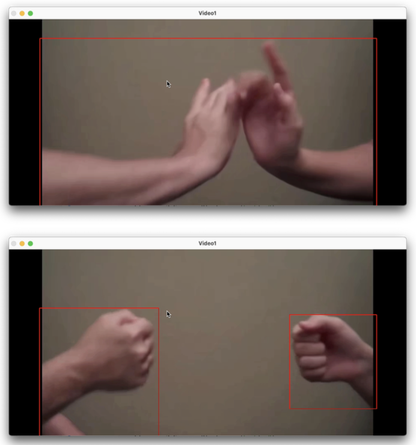
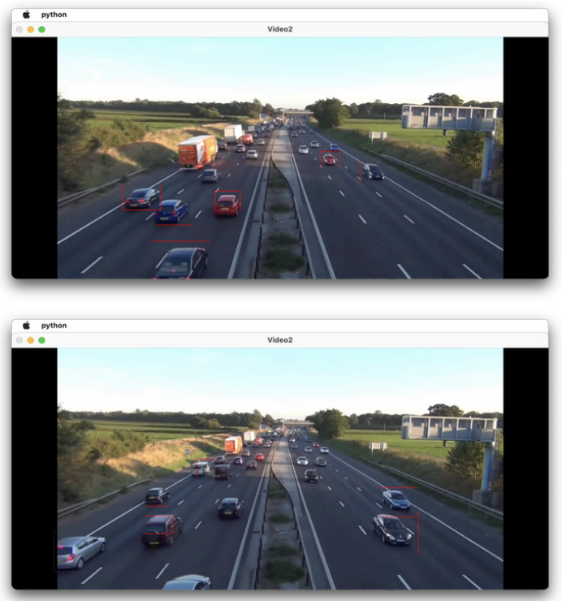

Development of an Object Recognition System in Videos – Implementing advanced techniques for detecting and tracking hands and vehicles.

**Project Overview**  
This project aimed to develop a system for recognizing specific objects (faces, hands, vehicles) in videos. The main functionalities include hand detection, face detection, and vehicle detection, designed to accurately capture object movements and visually confirm recognition.

**Key Features and Development Process**

- **Hand Detection**
  1. Converted RGB frames to HSV format to separate hand regions based on color.
  2. Applied background subtraction and thresholding to emphasize edges and separate hand areas.
  3. Converted frames back to RGB, where pixels outside a specific G-value range were marked black, ensuring clearer hand recognition.
  4. Used morphological and dilation operations to maintain object shape and drew bounding boxes around detected hands for verification.

  In the resulting images, overlapping hands are recognized as one bounding box, while separated hands are shown as distinct objects, demonstrating accurate detection.

- **Vehicle Detection**
  1. Loaded video frames and calculated the difference between current and previous frames to detect movement.
  2. Converted these frames to grayscale and applied Gaussian Blur to reduce noise.
  3. Used thresholding to highlight vehicle contours and remove the background.
  4. Applied dilation to fill small gaps and make contours more prominent.
  5. Drew bounding boxes around vehicles based on the contours detected.

  In the results, regular vehicles were detected accurately, while larger trucks or uniquely shaped vehicles sometimes showed multiple bounding boxes. Overall, the vehicle recognition was effective and stable.

**Project Outcomes**
- Gained experience in efficient image preprocessing and visualization techniques for object recognition.
- Utilized morphological operations and filtering techniques to improve recognition accuracy in varied environments.
- Successfully implemented object detection and visualization capabilities using video data.

This project enhanced my skills in applying object recognition algorithms and image preprocessing techniques in real-world settings.