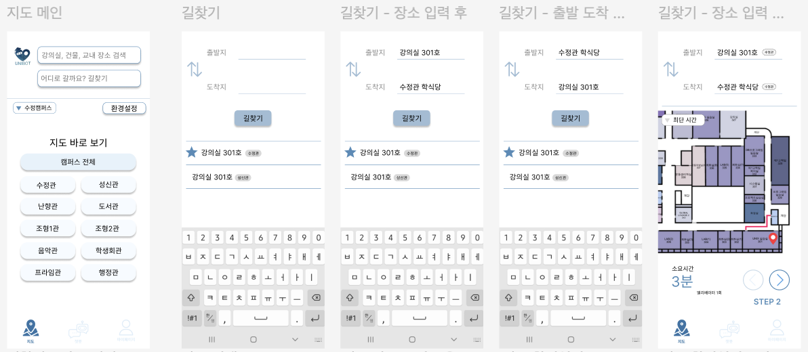
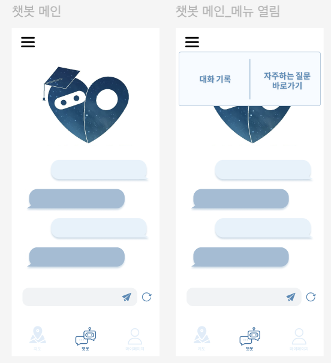

Development of 'UNIBOT' – Campus Navigation System and AI Chatbot Service, an advanced development of CAMVI

**Overview**  
UNIBOT is a mobile app available on both Android and iOS, featuring two main functions:
1. **AI Chatbot**: The chatbot provides users with quick answers to questions related to school, such as class schedules, exam dates, and campus events, offering essential information to enhance the convenience of student life.
2. **Campus Navigation System** (*Advanced development of CAMVI*): By inputting starting points and destinations, users can view the shortest route, considering elements like hills and stairs, allowing efficient navigation both indoors and outdoors. This feature helps students and faculty easily explore the campus and discover new locations.

**Key Features**
- **Chatbot Functionality**:
    - Provides real-time answers to campus-related questions, such as class schedules, exam dates, dining options, and campus events. The chatbot helps prevent redundant questions and offers concise responses, making information easily accessible.
    - Aiming to integrate the chatbot with the university website for seamless information access.

- **Navigation System**:
    - Optimized indoor and outdoor route display, showing the shortest path based on the campus floor plans.
    - Includes classroom seating information and a QR attendance system simulation for convenient check-ins.
    - Encourages exploration of new places on campus by offering location information and event details, making it more than just a navigation tool.

**Scalability**  
Beyond the campus, UNIBOT has the potential to expand to larger indoor spaces, such as COEX or Everland, where navigating complex venues can be challenging.

**Development Process**
- **Platform**: Supports Android and iOS, using Firebase for data management.
- **Mapping and Floor Plans**: Created accurate campus maps and developed optimized route display using Dijkstra’s algorithm.
- **Teamwork and Skills**: Comprised of team members with expertise in planning, development, design, and commercialization, we successfully managed all project phases, leveraging creative problem-solving and collaboration skills.

**Goal**
UNIBOT aims to enhance student life by providing easy access to essential information and optimizing campus navigation. Additionally, it seeks to expand its scope, becoming a versatile tool for navigation and information in various large-scale indoor venues.