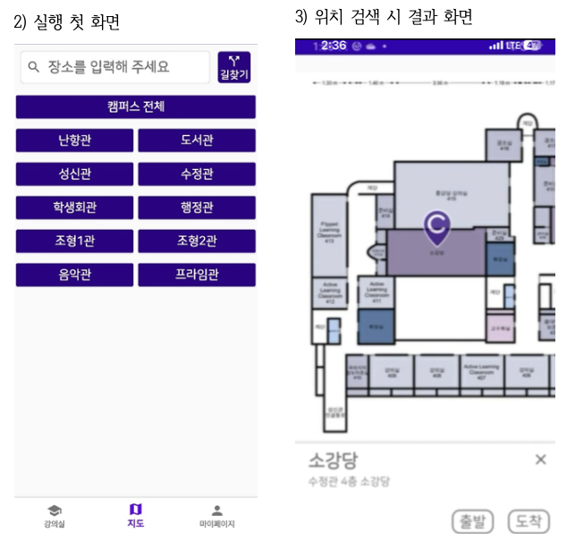
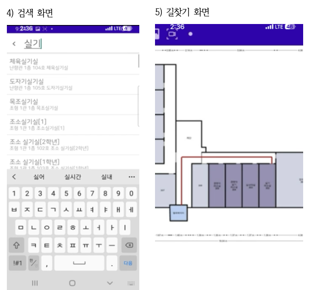

CAMVI: Campus Navigation App for Sungshin Women’s University

  
  

Developed **CAMVI**, an on-campus navigation application designed to assist students and faculty in easily locating buildings and classrooms at Sungshin Women’s University. This app addresses challenges faced by students returning to campus after remote learning, and is particularly helpful for those unfamiliar with campus layouts.

Project Highlights:
- **Real-time Navigation**: Users can set a starting point and destination, with the app providing the shortest route. Custom paths include shortcuts familiar to students, enhancing navigation efficiency.
- **Interactive Campus Map**: Detailed floor plans and building layouts are available, helping users navigate indoors and find specific classrooms and facilities.
- **Midpoint Finder**: Enables users to input multiple locations and identify a convenient meeting point, ideal for coordinating group activities.
- **Classroom Occupancy and Seating**: Allows users to view classroom seating arrangements, check occupancy levels, and even select available seats for upcoming classes.

Development Process:
- **Platform**: Built with Java on Android Studio, using Firebase for user authentication and data management.
- **Mapping and Floor Plans**: Created custom floor plans using Floorplanner, with color-coding to indicate different facility types. Developed pathfinding functionality using Dijkstra’s algorithm to calculate the shortest routes and display them on the map.
- **Team Collaboration**: Conducted weekly in-person meetings and daily online sessions using Google Meet. Documentation and progress tracking were managed with Notion and Google Drive.

CAMVI offers a scalable solution that could be adapted to other universities, providing new students with an intuitive tool to navigate complex campus environments.
