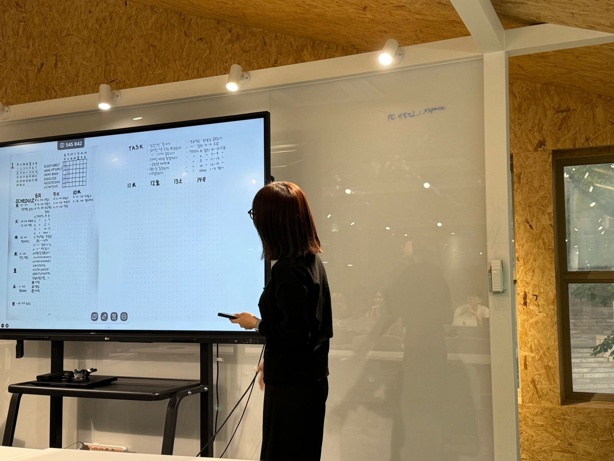
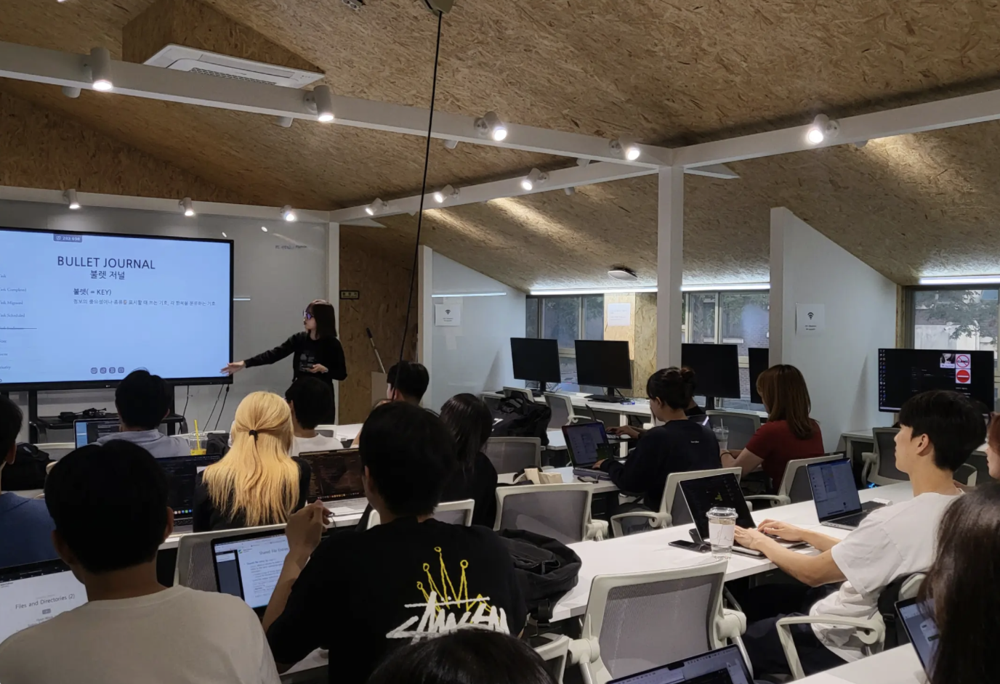

[More information about GDSC Konkuk here](https://landing.gdsc-konkuk.dev)

I gave a presentation on Documentation, Organization, and Planning, focusing specifically on the Bullet Journal method. During the session, I introduced the advantages of using a Bullet Journal, explained how to set one up, and provided examples of various layouts. I also shared my own personalized approach to Bullet Journaling, highlighting unique techniques I use to organize tasks and track goals effectively. This method not only enhances productivity but also adds a creative touch to daily planning.
