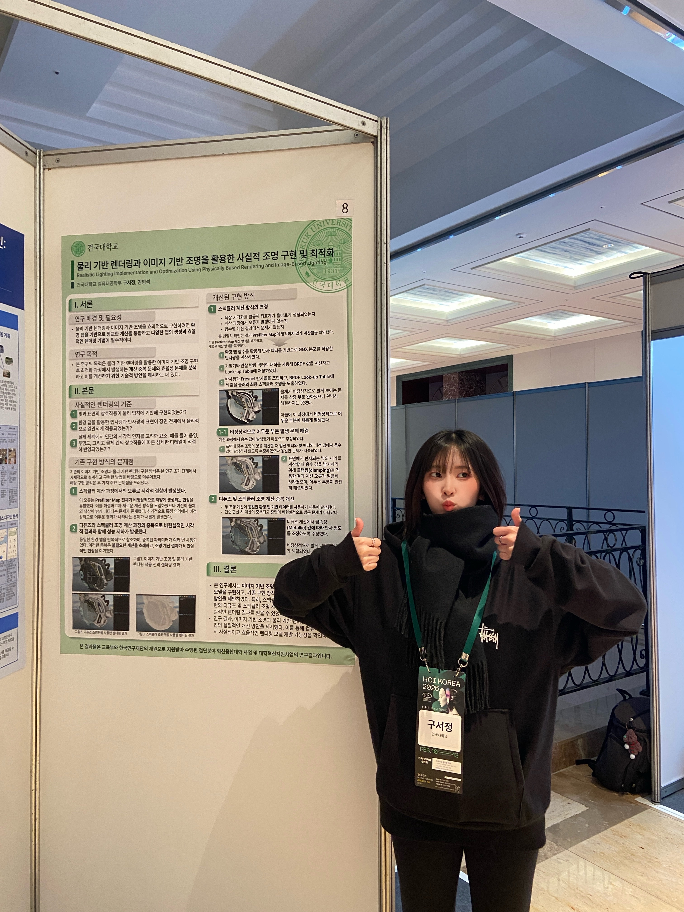
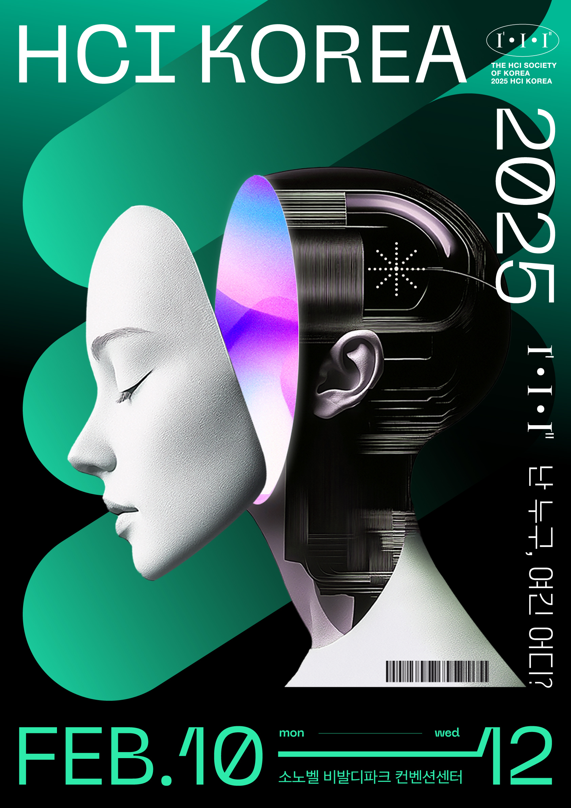

[More information about HCI KOREA 2025 here](https://conference.hcikorea.org/hcik2025/main/main.asp)

I presented a poster at the HCI KOREA 2025 conference on the paper titled "Realistic Lighting Implementation and Optimization Using Physically Based Rendering and Image-Based Lighting." The presentation focused on the research process and results of combining image-based lighting (IBL) with physically based rendering (PBR) to achieve realistic lighting effects. The poster conveyed the background and necessity of the research, the goals, the criteria for realistic rendering, the problems with existing implementations, and the improved implementation approach.
The core of this research is the design and implementation of a lighting model that adapts to various environmental and object data even in complex digital environments. Additionally, the study proposed a method to generate data and adjust lighting in real-time through physically based calculations, even when environmental maps are not provided. This approach has contributed to achieving realistic lighting effects in complex scenes.